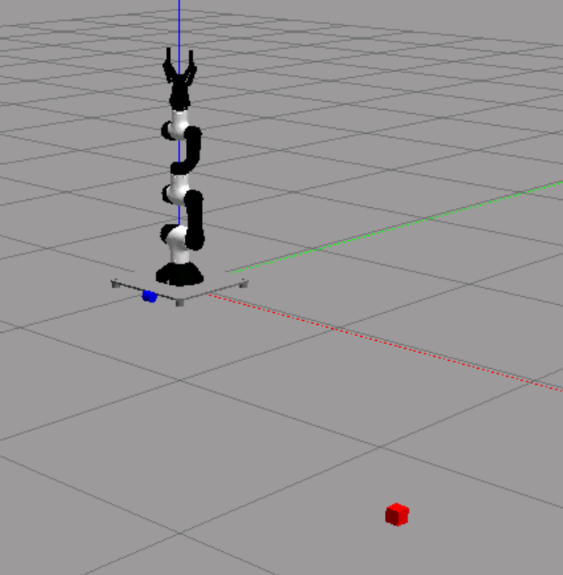

# Robotics I: Mara robot project

This repository contains all the necessary packages and files required to simulate and interact with the MARA Robot. You can also check the official [MARA](https://github.com/AcutronicRobotics/MARA/blob/dashing) repository, as this README provides instructions on how to simulate and control a MARA robot within the Gazebo simulator.

## Task overview

The goal of this robotics project is to:

* Compute the inverse kinematics of a MARA robot.
* Program the robot for a specific application using:
  * Python.
  * Robot Operating System (ROS2).

## Running the simulation

> **Construct Sim**:
>
> Here is the [link](https://app.theconstruct.ai/l/697827c9/) where you can replicate a simulation environment in Construct. Please fork it and modify the forked project. 

The main package used in this project is the `mara_gazebo`, which contains the Gazebo simulation environment for the MARA robot. This package relies on [`mara_description`](https://github.com/AcutronicRobotics/MARA/tree/dashing/mara_description), which provides 3D models of the MARA for simulation and visualization.

The `mara/mara_gazebo` contains several launch files that will aid you to define a specific application for your robot, specifically:

- `mara.launch.py` only spawn mara robot.
- `mara2.launch.py` spawn objects and mara robot.
- `only_world.launch.py` only spawn objects.
- `pick.launch.py` spawn objects and mara robot for pick and place scenario.

To run the ``pick.launch.py`` example, execute the following commands in a terminal:

```bash
cd ~/ros2_ws/
source install/setup.bash
ros2 launch mara_gazebo pick.launch.py
```

Once executed, Gazebo will launch and display the MARA robot alongside two boxes in the configured environment. After launching the simulation, you can inspect running nodes using:

```
ros2 node list
```

You can also check active topics with:

```
ros2 topic list
```

These commands, along with `ros2 topic echo` and `ros2 topic pub`, will be essential for validating your inverse kinematics implementation.

## Controlling the MARA Robot

To command the MARA robot, follow these steps:

1. Launch the MARA robot in a Gazebo environment using any of the launch files specified ubove, ex. `mara.launch.py`:

```
cd ~/ros2_ws/
source install/setup.bash
ros2 launch mara_gazebo mara.launch.py
```

2. Run the example control script either `mara_minimal_publisher_v1` or `mara_minimal_publisher_v2` in a separate terminal:

```
cd ~/ros2_ws/
source install/setup.bash
ros2 run mara_minimal_publisher mara_minimal_publisher_v1
```

After running the script, the robot will move towards a predefined configuration. You can inspect the `mara_minimal_publisher_vX` script for insights on interfacing with robot joint configurations.

## Configuring the Simulation Scene

To design a custom validation scenario, you need to modify the `.world` file. This file defines the simulation scene in Gazebo. In ordert to access this file you need to navigate to `mara_gazebo` to locate it, you will see the structur:

```bash
mara_gazebo
  |-- CMakeLists.txt
  |-- launch
  |   |-- mara.launch.py
  |   |-- mara2.launch.py
  |   |-- only_world.launch.py
  |   `-- pick.launch.py
  |-- package.xml
  `-- worlds
      |-- mara_world.world
      `-- pick.world

2 directories, 8 files
````

The `*.world` files contain objects in [SDF format](http://sdformat.org/), which defines the physical properties, geometry, and other attributes of models within the Gazebo simulation.

Each of the specified launch files (that contains object in the scene)  is using a specific world file so you cna inspect the launch to know which is designated to what.

For example, in the `pick.world` file, the `cube` model is defined as follows:

```xml
    <!-- Cube for pick and place -->
    <model name="cube1">
      <pose>0 -0.5 0.475 0 0 0</pose>
      <link name="link">
        <inertial>
          <mass>0.1</mass>
          <inertia>
            <ixx>0.000167</ixx>
            <iyy>0.000167</iyy>
            <izz>0.000167</izz>
            <ixy>0</ixy>
            <ixz>0</ixz>
            <iyz>0</iyz>
          </inertia>
        </inertial>
        <collision name="collision">
          <geometry>
            <box>
              <size>0.05 0.05 0.05</size>
            </box>
          </geometry>
          <surface>
            <friction>
              <ode>
                <mu>1.0</mu>
                <mu2>1.0</mu2>
                <fdir1>0 0 1</fdir1>
                <slip1>0.0</slip1>
                <slip2>0.0</slip2>
              </ode>
            </friction>
            <contact>
              <ode>
                <kp>10000.0</kp>
                <kd>1.0</kd>
                <max_vel>0.1</max_vel>
                <min_depth>0.001</min_depth>
              </ode>
            </contact>
          </surface>
        </collision>
        <visual name="visual">
          <geometry>
            <box>
              <size>0.05 0.05 0.05</size>
            </box>
          </geometry>
          <material>
            <ambient>1 0 0 1</ambient>
            <diffuse>1 0 0 1</diffuse>
            <specular>0.1 0.1 0.1 1</specular>
          </material>
        </visual>
      </link>
    </model>
```

This SDF file defines key properties such as:

* Pose: The initial position and orientation.
* Inertial properties: Mass and inertia tensor.
* Collision properties: Physics-based interactions.
* Visual properties: Appearance in simulation.
* and more ...
  For a tutorial on SDF worlds and models, refer to [SDF worlds](https://gazebosim.org/docs/latest/sdf_worlds/) or [the Construct tutorial](https://www.theconstruct.ai/gazebo-5-minutes-004-create-gazebo-model-using-sdf/). 

## Tips

* Carefully position objects and fine-tune properties to avoid unrealistic scenarios in Gazebo. an example: 
* Use debugging commands such as ros2 node list and ros2 topic list to validate your setup.
* You are supposed to make your own ROS2 package to test your algorithm. Additionally, when doing so, do not forget to source your package source file i.e, `install/setup.bash`

# Troubleshooting & Support 

If you find a bug in the repository, require assistance, or have any other questions, please open an issue in the repository **(recommended)** or contact one or more of the following via email:

* Mohayad Omer `Mohayad.omer99@gmail`
* Chaoyue Fei `Chaoyue.Fei@vub.be`

We will try to help you as soon as possible.
