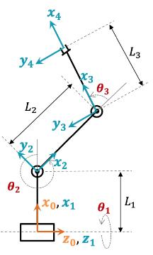

# Forward Kinematics for robotic manipulators

This package provides Python code and conceptual explanations to help students understand and implement **forward kinematics (FK)** problem  for robotic manipulators using the **Denavit-Hartenberg (DH)** convention.

## 📁 Package Contents
| File | Description |
|------|-------------|
| `kinematics.py` | Python module with functions to compute FK using DH parameters. |
| `3dof_test.py` | Example script that applies FK to a 3-DOF RRR manipulator. |
| `README.md` | You're reading it! |
---

## 🔩 The robot and Its DH parameters

THe kinematics of a **n-DoF robot** can be described using the Denavit–Hartenberg (DH) convention. This method standardizes how we represent the position and orientation of each link in a manipulator.

We will use a 3-DOF RRR (Revolute-Revolute-Revolute) manipulator as our example. Its DH parameters are shown below:
<p align="center">
  


| i     | a<sub>i</sub>   | α<sub>i</sub> | d<sub>i</sub> | θ<sub>i</sub>        |
|-------|-------|-----|-----|------------|
| 1     | 0   | 0   | 0   | θ<sub>1</sub>        |
| 2     | L<sub>1</sub>   | -90  | 0   | θ<sub>2</sub>        |
| 3     | L<sub>2</sub>    | 0   | 0   | θ<sub>3</sub>        |
| 4     | L<sub>3</sub>   | 0   | 0   |  0   (fixed)   |

</p>

> ⚠️ **Note:** θ<sub>i</sub> values here are symbolic placeholders corresponding to revolute joint variables. For a step-by-step tutorial on constructing such a table, watch [this video](https://www.youtube.com/watch?time_continue=1&v=rA9tm0gTln8&source_ve_path=MjM4NTE) .
[this video](https://www.youtube.com/watch?time_continue=1&v=rA9tm0gTln8&embeds_referring_euri=https%3A%2F%2Fblog.robotiq.com%2Fhow-to-calculate-a-robots-forward-kinematics-in-5-easy-steps&source_ve_path=MjM4NTE) 
---

## 📐 Forward Kinematics (FK)
**Forward kinematics** computes the **position and orientation** of the end-effector given the joint variables (θ<sub>i</sub>). We use the DH table defined above to compute the transformation from base to end-effector.

### Step 1: Construct the homogeneous transformation matrix
The first step is to construct the **homogeneous transformation matrix** for each link using the DH parameters:

$$
T_i = 
\begin{bmatrix}
\cos\theta & -\sin\theta \cos\alpha & \sin\theta \sin\alpha & a \cos\theta \\
\sin\theta & \cos\theta \cos\alpha & -\cos\theta \sin\alpha & a \sin\theta \\
0 & \sin\alpha & \cos\alpha & d \\
0 & 0 & 0 & 1
\end{bmatrix}
$$

The following fucntion constructs the homogenious transsformation matrix:

```python
# kinematics.py
import numpy as np
from scipy.spatial.transform import Rotation as R

def dh_transform(theta, d, a, alpha):
    """
    Compute the homogeneous transformation matrix using DH parameters.

    Args:
        theta: Joint angle (in radians)
        d: Link offset
        a: Link length
        alpha: Link twist

    Returns:
        4x4 Homogeneous transformation matrix
    """
    ct, st = np.cos(theta), np.sin(theta)
    ca, sa = np.cos(alpha), np.sin(alpha)

    return np.array([
        [ct, -st * ca,  st * sa, a * ct],
        [st,  ct * ca, -ct * sa, a * st],
        [0,       sa,      ca,      d],
        [0,        0,       0,      1]
    ])
```

### Step 2: Perform the FK from base to End-effector
To obtain the final transformation from the base to the end-effector, we perform matrix multiplication:
$$
T_{0}^{4} = T_{0}^{1} \cdot T_{1}^{2} \cdot T_{2}^{3} \cdot T_{3}^{4}
$$
```python
# kinematics.py
def forward_kinematics(dh_params, return_all=False):
    """
    Compute the forward kinematics based on a DH table.

    Args:
        dh_params: list of dictionaries, each containing keys ['theta', 'd', 'a', 'alpha']
        return_all: if True, returns intermediate transforms

    Returns:
        T (final transformation matrix) or list of intermediate transforms if return_all=True
    """
    T = np.eye(4)  # Identity matrix
    Ts = [T]
    for param in dh_params:
        T = T @ dh_transform(param['theta'], param['d'], param['a'], param['alpha'])
        Ts.append(T)
    
    if return_all:
        return Ts
    else:
        return T
```


This will give us the homogeneous transformation matrix in the following form:

$$
T_0^4 = \begin{bmatrix}
\mathbf{R} & \mathbf{p} \\
\mathbf{0}^T & 1
\end{bmatrix}
=
\begin{bmatrix}
r_{11} & r_{12} & r_{13} & x \\
r_{21} & r_{22} & r_{23} & y \\
r_{31} & r_{32} & r_{33} & z \\
0 & 0 & 0 & 1
\end{bmatrix}
$$


To extract the **position** and **orientation** of the end-effector from the final matrix, we read:

- The position from the **last column** \( (x, y, z) \)
- The orientation from the **top-left 3×3 rotation matrix** \( $\mathbf{R}$ \)
```python
# kinematics.py
def end_effector_position(T):
    """
    Extract the position of the end-effector from the transformation matrix.

    Args:
        T: Homogeneous transformation matrix

    Returns:
        position: 3D position of the end-effector (x, y, z)
    """
    return T[:3, 3]

def end_effector_orientation(T, degrees=True):
    """
    Extract the orientation (Euler angles) of the end-effector from the transformation matrix.

    Args:
        T: Homogeneous transformation matrix
        degrees: whether to return angles in degrees (default=True)

    Returns:
        Euler angles (yaw, pitch, roll) in the specified units
    """
    r = R.from_matrix(T[:3, :3])  # Convert rotation matrix to rotation object
    return r.as_euler('zyx', degrees=degrees)
```
### Step 3: Test with the 3DoF example
Now that the functions are defined, we can run the example script to visualize the results.
```bash
python3 3dof_test.py
```
In the terminal, you will see the following output:
```bash
End-effector position: x=1.99, y=-0.53, z=-1.06
```

## What is the next step?

You now know how to compute forward kinematics using the DH convention. Your next task is to apply this method to a 6-DOF  MARA robot. To do so:
1. Extract the MARA robot's DH table.
2. Implement the FK computation as shown above.

### What About Inverse Kinematics??

**Inverse kinematics (IK)** determines the **joint angles** required to reach a desired end-effector pose. For robots with a spherical wrist (e.g., UR5, MARA), you can use **Kinematic decoupling**. Kinematic decoupling separates the inverse kinematics problem into two sub-problems:

1. Solving for **position** of the wrist center.
2. Then solving for **orientation** of the end-effector using the last three joints.

> 📚 For a deeper explanation on how to apply this, refer to ... and this [book](./chapter2_3.pdf).

### Final tip: using ``atan2(y, x)``

To compute joint angles, you may need to use the ``atan2(y, x)`` function. This function computes the arctangent of ``y/x``, and:
  - Handles **all 4 quadrants** correctly.
  - Avoids **division by zero**.
  - Returns results in the range \([-pi, pi]\), making it ideal to compute joint angles.
---
